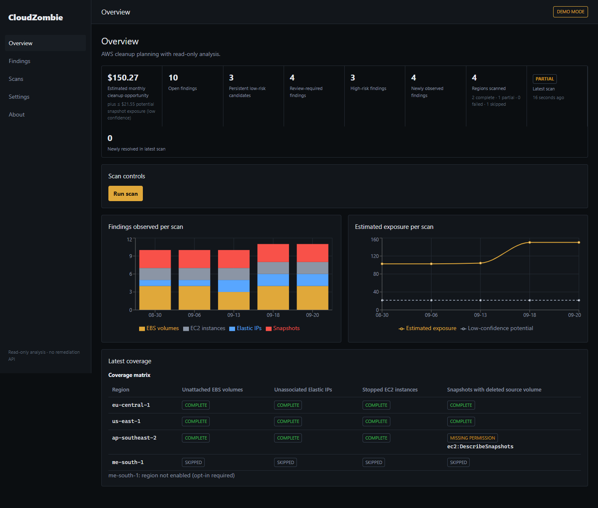
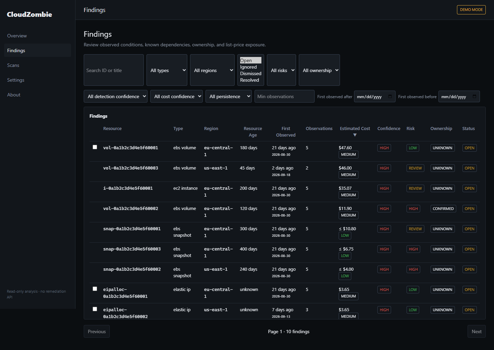
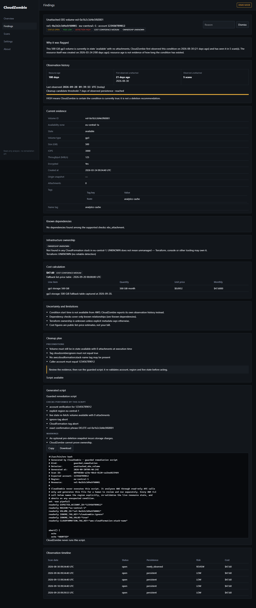
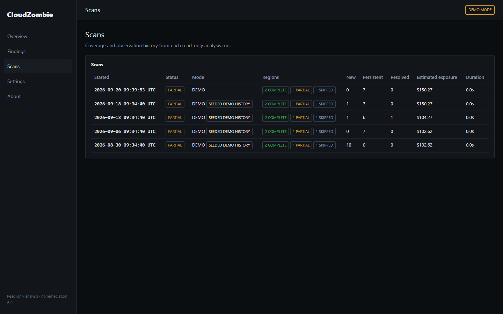

# CloudZombie

Cloud cost tools can tell you that a resource may be costing money. CloudZombie focuses on the next step: showing why a resource deserves review and generating guarded cleanup instructions without giving the application write access to your AWS account.

CloudZombie is a self-hosted AWS cleanup planner. It discovers four resource conditions, records its own observation history, checks known dependencies and CloudFormation ownership, estimates monthly public list-price exposure, and generates scripts for a human to inspect and run separately.

## Problem

A resource being old or billable does not prove that it is safe to remove. AWS creation timestamps do not say when a volume became unattached, when an address became unassociated, or when a snapshot stopped being useful. Cost data also does not capture business intent, ownership, recovery requirements, or every dependency.

CloudZombie keeps those concerns separate: current condition, observation history, known dependencies, ownership evidence, cost estimate, remediation risk, and the final human decision.

## What CloudZombie does

- Discovers unattached EBS volumes, unassociated Elastic IPs, stopped EC2 instances, and snapshots with deleted source volumes.
- Reconciles findings across scans without treating missing permission as absence.
- Reports resource age separately from the age of CloudZombie's observation streak.
- Checks registered dependency types and CloudFormation ownership evidence.
- Estimates monthly public list-price exposure through the AWS Pricing API or a deterministic fallback table.
- Produces cleanup plans and guarded Bash scripts containing validated identifiers only.
- Runs in deterministic demo mode without AWS credentials.

## What CloudZombie does not do

- It does not expose a remediation API or call mutating AWS APIs.
- It does not prove that a resource is unnecessary.
- It does not discover every possible dependency.
- It does not infer Terraform ownership.
- It does not calculate a customer's final bill or guaranteed savings.
- It does not execute generated scripts.

## Screenshots / demo


_Overview totals, scan controls, trends, and coverage._


_Dense findings table with age, observation, cost, confidence, risk, ownership, and status._


_The finding detail page separates evidence, history, dependencies, ownership, cost, plan, and script._


_Scan history and partial-coverage visibility._

### 60-second demo walkthrough

1. Open `http://127.0.0.1:3000`.
2. Point out the `DEMO MODE` indicator: no AWS credentials are required.
3. Select **Run scan** and wait for the new, persistent, and resolved counts.
4. Read the total **Estimated monthly cleanup opportunity** and the separate low-confidence snapshot exposure.
5. Open `vol-0a1b2c3d4e5f60001` from Findings.
6. Compare **Resource age: 180 days**, **First observed unattached: 21 days ago**, and **Observed unattached: N scans**. These are different facts.
7. Review `$47.60`, detection confidence `HIGH`, and remediation risk `LOW`.
8. Review Known dependencies and Infrastructure ownership.
9. Read the cleanup plan, preconditions, limitations, and recommended action.
10. Inspect the generated script: expected account, explicit region, validated volume ID, live `describe-volumes`, ignore-tag check, and exact confirmation phrase.

CloudZombie itself never has a remediation API; the generated script is a separate artifact for a human to review and run.

## Supported detectors

| Detector | Current condition | Detection confidence | Remediation risk | Script offered |
|---|---|---|---|---|
| Unattached EBS volume | `State == available` and no attachments | HIGH | REVIEW until persistent; LOW when persistent; ownership or blocking dependencies can raise it | Guarded deletion only when open and LOW; otherwise investigation |
| Unassociated Elastic IP | No association, instance, or network interface | HIGH | REVIEW until persistent; LOW when persistent; ownership or blocking dependencies can raise it | Guarded release only when open and LOW; otherwise investigation |
| Stopped EC2 instance | Instance state is `stopped` | HIGH | REVIEW, with normal ownership/dependency escalation | Read-only investigation only; no termination command |
| Snapshot with deleted source volume | Completed account-owned snapshot references a valid volume ID absent from the region | HIGH | REVIEW, raised to HIGH by blocking dependencies | Read-only investigation; deletion appears only as a commented command |

## Observation-history model

**Resource age is not time unused.** CloudZombie shows three separate facts:

1. Resource age from AWS metadata, where available.
2. First time CloudZombie observed the current detector condition.
3. Number of scans and consecutive scans that observed it.

See [docs/observation-model.md](docs/observation-model.md) for reconciliation and wording rules.

| Detector | Default persistence threshold |
|---|---:|
| Unattached EBS volume | 7 days |
| Unassociated Elastic IP | 1 day |
| Stopped EC2 instance | 7 days |
| Snapshot with deleted source volume | 30 days |

A finding also needs at least two consecutive observations by default.

## Safety architecture

```text
Next.js frontend -> FastAPI/services -> scanner/persistence/remediation
                                      -> detectors/dependencies/ownership/pricing
                                      -> CloudProvider
                                         |- DemoProvider
                                         `- AwsProvider -> restricted read-only wrappers
```

- `guard.py` rejects operations outside the exact allowlist before a request is sent.
- `ScanScopedProvider` memoizes read-only calls and provider errors for one scan.
- Application logic receives domain records, not raw boto3 clients.
- The script generator accepts validated account, region, resource, scan, and tag identifiers; it never receives finding titles, evidence, descriptions, or arbitrary tags.

See [docs/security-model.md](docs/security-model.md) and [docs/remediation.md](docs/remediation.md).

## Security

- **Scanner credentials are read-only.** CloudZombie itself should run with the checked-in least-privilege policy in [docs/iam-policy.json](docs/iam-policy.json). The runtime allowlist and that policy are asserted equal by a test.
- **Remediation needs a different principal.** Generated remediation scripts perform destructive AWS CLI operations and therefore cannot be executed using the CloudZombie read-only principal. A human must execute them separately using a deliberately authorized AWS principal with the minimum permissions required for that chosen operation, for example `sts:GetCallerIdentity`, `ec2:DescribeVolumes`, and `ec2:DeleteVolume` for one guarded volume deletion. Do not attach `ec2:*` and do not give CloudZombie write access. The per-script action list is in [docs/remediation.md](docs/remediation.md#scanner-credentials-are-not-remediation-credentials).
- **No credentials are committed.** `.env.example` contains placeholders only. `.gitignore` and both `.dockerignore` files exclude `.env` files, private keys and keystores (`*.pem`, `*.key`, `*.p12`, `*.pfx`, `*.jks`, `*.keystore`), and `.aws/`.
- **Standard credential chain.** Live mode uses the normal boto3/AWS CLI credential resolution (`AWS_PROFILE`, environment variables, shared files). Docker live mode mounts `${HOME}/.aws` read-only. Secret keys and session tokens are never persisted, logged, or returned by the API.
- **Secret scanning in CI.** The `secret-scan` job runs Gitleaks over the full history on every push and pull request. `.gitleaks.toml` keeps the default rules and allowlists only AWS resource-ID shapes that appear in fixtures and tests.
- **Localhost-only by default.** Compose publishes `127.0.0.1:3000` and `127.0.0.1:8000` only. CloudZombie has no user authentication; remote deployment requires an explicit network or authentication layer and is outside the default configuration.
- **Non-root containers.** The backend runs as UID 1000 and the frontend as UID 1001; CI asserts both.

## Read-only AWS wrapper

| Wrapper | Exposed methods |
|---|---|
| `ReadOnlyEc2` | `describe_regions`, `describe_volumes`, `describe_addresses`, `describe_instances`, `describe_snapshots`, `describe_images`, `describe_snapshot_attribute`, `describe_locked_snapshots` |
| `ReadOnlySts` | `get_caller_identity` |
| `ReadOnlyPricing` | `get_products` |
| `ReadOnlyCloudFormation` | `list_stacks`, `list_stack_resources` |

Clients are name-mangled private attributes. There is no generic `client`, `call`, or `execute` escape hatch.

## IAM permissions

The policy is in [docs/iam-policy.json](docs/iam-policy.json). It allows exactly:

- `ec2:DescribeRegions`
- `ec2:DescribeVolumes`
- `ec2:DescribeAddresses`
- `ec2:DescribeInstances`
- `ec2:DescribeSnapshots`
- `ec2:DescribeImages`
- `ec2:DescribeSnapshotAttribute`
- `ec2:DescribeLockedSnapshots`
- `sts:GetCallerIdentity`
- `pricing:GetProducts`
- `cloudformation:ListStacks`
- `cloudformation:ListStackResources`

There is no CloudWatch permission and no `ec2:*` wildcard.

## Dependency checks

The registry currently contains nine kinds:

- `ebs_attachment`
- `eip_association`
- `attached_ebs_volume`
- `associated_elastic_ip`
- `registered_ami`
- `shared_snapshot`
- `public_snapshot`
- `snapshot_lock`
- `aws_backup_managed`

These are **Known dependencies, not all dependencies**. EC2 attached volumes and associated addresses are reported but do not block the instance investigation; the other registered checks block destructive remediation when present.

## CloudFormation ownership

- `CONFIRMED`: the resource's physical ID is present in the current stack-resource index. Change the stack rather than deleting manually.
- `LIKELY`: the resource carries `aws:cloudformation:*` tags but is absent from the index, such as a retained resource.
- `UNKNOWN`: no CloudFormation evidence was found, or CloudFormation could not be queried. UNKNOWN does not mean unmanaged.

Terraform remains `UNKNOWN`; CloudZombie does not guess Terraform ownership.

## Cost methodology

See [docs/pricing.md](docs/pricing.md).

CloudZombie reports **estimated monthly list-price exposure**, not savings. Pricing confidence is:

- HIGH: AWS Pricing API.
- MEDIUM: checked-in fallback table.
- LOW: snapshot upper bound, regardless of unit-price source.
- UNAVAILABLE: no estimate could be calculated.

The headline exposure includes open findings with HIGH or MEDIUM confidence. LOW-confidence snapshot upper bounds are shown separately.

## Snapshot limitations

EBS snapshots are incremental. AWS does not expose exact independently reclaimable blocks through the APIs used here. Snapshot size multiplied by a list price is an upper bound and deleting a snapshot may free much less storage than its apparent size. Snapshots may also support AMIs, sharing, backup plans, or locks.

## Demo mode

### Docker Compose

```bash
docker compose up --build
```

Then open `http://127.0.0.1:3000`. PostgreSQL, the backend, and the frontend start with health checks and dependency ordering; migrations apply automatically on first start and demo history is seeded once. Both published ports bind to `127.0.0.1` only.

### Without Docker

The helper scripts assume Bash:

```bash
scripts/dev-backend.sh
scripts/dev-frontend.sh
```

Equivalent explicit commands:

```bash
cd backend
python -m venv .venv
./.venv/Scripts/python.exe -m pip install -e ".[dev]"
CLOUDZOMBIE_MODE=demo DATABASE_URL=sqlite:///./cloudzombie.db ./.venv/Scripts/python.exe -m uvicorn app.main:app --port 8000
```

On Linux or macOS, use `./.venv/bin/python` instead. In another shell:

```bash
cd frontend
npm install
BACKEND_URL=http://localhost:8000 npm run dev
```

CLI scan:

```bash
cd backend
CLOUDZOMBIE_MODE=demo DATABASE_URL=sqlite:///./cloudzombie.db ./.venv/Scripts/python.exe -m app.cli scan
```

Demo mode seeds four scans at 21, 14, 7, and 2 days before its anchor by running the real scan engine. It does not hand-write findings.

## AWS mode

1. Attach the policy in [docs/iam-policy.json](docs/iam-policy.json) to the intended IAM principal.
2. Configure the standard boto3 credential chain, such as a profile:

```bash
export AWS_PROFILE=my-read-only-profile
docker compose -f docker-compose.yml -f docker-compose.live.yml up --build
```

The live override also passes through `AWS_REGION_SELECTION`, `AWS_ACCESS_KEY_ID`, `AWS_SECRET_ACCESS_KEY`, and `AWS_SESSION_TOKEN`, and mounts `${HOME}/.aws` read-only. The UI displays the verified account, principal ARN, and a `LIVE AWS` indicator. Secret keys and session tokens are never persisted, logged, or returned.

**Live AWS validation: not performed.** Live mode has been exercised only against moto and botocore Stubber in this repository's tests; no authorized AWS account was available during release verification. To validate it yourself against a non-production account with only the policy above attached:

```bash
aws sts get-caller-identity --profile <read-only-profile>
export AWS_PROFILE=<read-only-profile>
docker compose -f docker-compose.yml -f docker-compose.live.yml up --build
```

Then confirm the account ID, principal ARN, and `LIVE AWS` indicator in the UI, run a scan, and review region coverage. The application performs no write calls; CloudTrail will show only the twelve `Describe`/`List`/`Get` operations listed above.

## Docker setup

Compose defines PostgreSQL, the FastAPI backend, and the standalone Next.js frontend with health checks and dependency ordering. The backend image runs as UID 1000, waits for the database, applies Alembic migrations, and starts Uvicorn. The frontend image runs as UID 1001 and forwards same-origin `/api/*` requests to `BACKEND_URL` at request time (`frontend/proxy.ts`), so the same image works with any backend address. Host ports are published on `127.0.0.1` only.

The CI `docker` job builds both images from scratch, starts the stack, asserts the non-root users and loopback bindings, runs the API smoke flow and two consecutive demo scans with observation-history assertions, measures read latency, runs the Playwright flow, and checks that data survives `docker compose restart` and `down`/`up`.

## Testing

Backend:

```bash
cd backend
./.venv/Scripts/python.exe -m ruff check .
./.venv/Scripts/python.exe -m ruff format --check .
./.venv/Scripts/python.exe -m mypy app
./.venv/Scripts/python.exe -m pytest -q
```

Frontend:

```bash
cd frontend
npm run lint
npm run format:check
npx tsc --noEmit
npm run test
npm run build
```

End to end, with backend and frontend already running:

```bash
cd frontend
E2E_BASE_URL=http://localhost:3000 npx playwright test
```

The cross-platform aggregate script assumes Bash:

```bash
scripts/check-all.sh
```

### Verified in the release run

Measured in the final verification run (clean virtual environment and `npm ci`, plus the GitHub Actions run on `main`):

- Backend: 236 pytest tests passed, 0 failed, 0 skipped, 94% line coverage; Ruff lint and format checks, mypy strict on `app`. The CI job runs the same suite against PostgreSQL 16 as well as SQLite.
- Frontend: 14 Vitest tests passed; ESLint, Prettier check, `tsc --noEmit`, and the production build passed.
- Generated scripts: all 7 golden scripts, `backend/entrypoint.sh`, and `scripts/*.sh` pass ShellCheck at style severity.
- Docker Compose: `docker compose config`, image builds, healthy start, non-root users, loopback bindings, API smoke flow, two-scan observation-history assertions, read-latency loop, restart and `down`/`up` persistence, and teardown, all in CI.
- Playwright: 1 end-to-end demo flow, run against the Compose stack in CI, including page-error and HTTP 5xx assertions.
- Secret scanning: Gitleaks reports no leaks across the full Git history and the tracked working tree.
- Dependency audits: `pip-audit` and `npm audit` report no known vulnerabilities.
- Not performed: live AWS. See [AWS mode](#aws-mode).

## CI

`.github/workflows/ci.yml` runs with `permissions: contents: read` and defines:

- `secret-scan`: Gitleaks over the full history.
- `backend`: PostgreSQL and SQLite tests, Ruff, formatting, mypy, coverage artifact.
- `frontend`: ESLint, Prettier check, TypeScript, Vitest, production build.
- `shellcheck`: golden scripts, backend entrypoint, and repository scripts.
- `docker`: Compose build/start, non-root and loopback assertions, API smoke flow and observation-history checks, latency loop, Playwright Chromium flow, restart persistence, logs artifact, cleanup.

## Known limitations

- AWS only.
- One AWS account per deployment and scan.
- Four detectors.
- No automatic remediation.
- No comprehensive dependency graph.
- Terraform ownership remains unknown.
- AWS does not provide condition start time; CloudZombie uses its own observation history.
- Public list prices are not the final bill.
- Snapshot cleanup opportunity is inexact because snapshots are incremental.
- CloudZombie cannot determine business intent.
- Remediation requires human judgment.
- A read-only application architecture does not prove the configured IAM credentials lack write permission.
- No user authentication; the default deployment binds to localhost only.
- Live AWS was not exercised; provider behavior is covered with moto and Stubber.

## Roadmap

The following items are not implemented:

- Terraform state integration.
- AWS Organizations and multi-account scanning.
- RDS, NAT Gateway, and S3 detectors.
- AWS Compute Optimizer import.
- CloudWatch utilization analysis.
- Scheduled scans and notifications.
- GCP support.
- Azure support.

## License

CloudZombie is licensed under the [MIT License](LICENSE).
